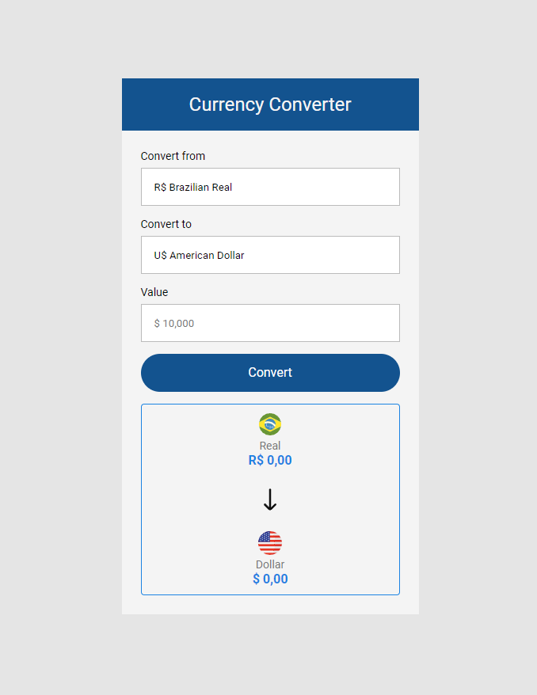

# Currency Converyer

This project uses an endpoint from the Awesome API to fetch the currency value. The conversion is in real time and it also works in both ways.

[Click here to test](https://luciofer.github.io/currency-converter/)

## 👩🏾‍💻 Technologies

- HTML5 and CCS3
- JavaScript
- AwesomeAPI - Currency API
- Git and Github

## ✉ Contact

contatolucioaraujo@gmail.com

[Linkedin](https://www.linkedin.com/in/lucioaraujo30/)